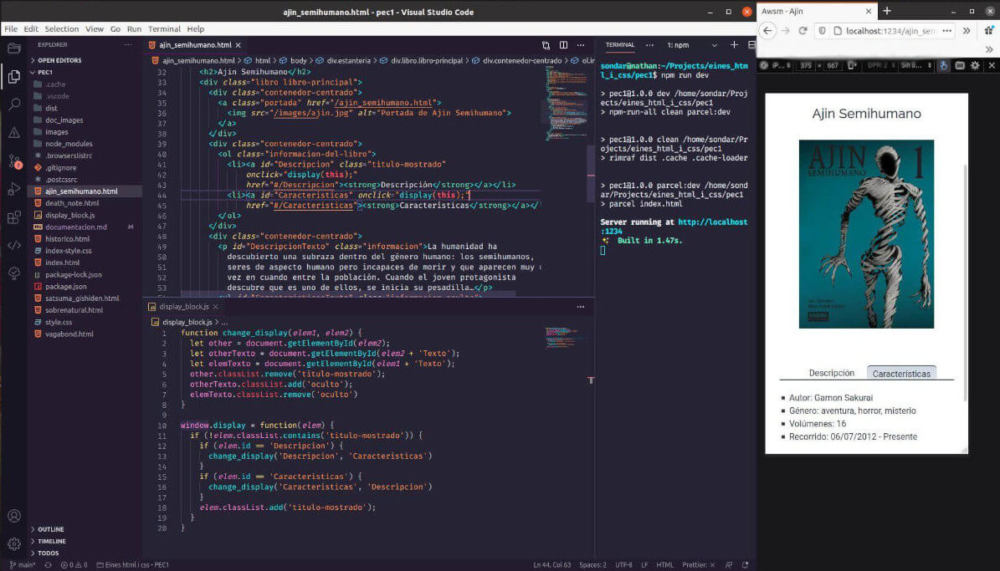

# Documentación de la PEC1

## 1. Instalación de dependencias

Para comenzar, se ha creado el paquete inicial de npm con los valores por defecto con el comando:

`npm init -y`

A continuación se procede a instalar las dependencias de desarrollo con los siguientes comandos:

```
npm i -D parcel-bundler
npm i -D rimraf
npm i -D npm-run-all
npm i -D autoprefixer
npm i -D prettier
```

O podemos instalar los cincos paquetes en una línea con el comando:

`npm i -D parcel-bundler rimraf npm-run-all autoprefixer prettier`

Todos estos pasos se pueden realizar en un comando si ya disponemos del archivo _package.json_ correctamente configurado y ejecutamos el comando:

`npm install`

Una vez instalados los paquetes, configuramos los scripts que vamos a utilizar durante el desarrollo del proyecto:

- `"parcel:dev": "parcel index.html"`: Este comando utiliza parcel para lanzar el servidor de desarrollo, usando como página de entrada la página _index.html_.
- `"parcel:build": "parcel build index.html"`: Con este comando le decimos a parcel que cree la carpeta de producción con la configuración que especificaremos luego de _Babel_ y _Postcss_.
- `"clean": "rimraf dist .cache .cache-loader"`: _rimraf_ elimina todos los ficheros de las carpetas que se especifican.
- `"dev": "npm-run-all clean parcel:dev"`: npm-run-all sirve para lanzar varios comandos de npm en un solo script.
- `"build": "npm-run-all clean parcel:build"`
- `"format": "prettier --write \"*.js\" \"*.md\" \"*.html\" \"*.css\""`: prettier sirve para dar formato a los ficheros. De esta manera nos aseguramos que todos los archivos tengan la misma estructura, algo especialemte útil si trabaja más de una persona en el mismo proyecto.

**_Los siguientes pasos de este apartado no son necesarios si se clona el repositorio._**

En este punto iniciamos el repositorio git con `git init` y configuramos el fichero _.gitignore_ para no rastrear ficheros como dependencias o configuraciones del editor de texto:

```
node_modules/
dist/
.vscode/
.cache/
```

#### Configuramos el fichero _.postcssrc_

Postcss es una herramienta incluida en Parecel que sirve para transformar el CSS mediante plugins. En este caso vamos a utilizar el plugin _autoprefixer_, que es un postprocesador de CSS que añade prefijos para que nuestro código sea compatible con distintos navegadores.

```
{
  "plugins": {
    "autoprefixer": true
  }
}
```

#### Finalmente procedemos a configurar el fichero _.browserlistrc_

Por defecto _autoprefixer_ se fija solo en als 2 últimas versiones de los principales navegadores. Para que ampliar el rango de navegadores para los que adaptaremos nuestro código debemos configurar un fichero de nombre _.browserlistrc_. Dentro de este fichero escribiremos lo siguiente:

```
last 4 version
> 2%
not dead
IE 11
```

## 2. Entorno de desarrollo

Para el desarrollo de la web he utilizado dos herramientas: _VSCode_ y _Firefox_. He utilizado mucho la opción de dividir el editor en distintas ventanas junto con parcel y npm para que se fuera refrescando la página mientras trabajaba en ella. También he utilizado intensivamente las herramientas para desarrolladores de Firefox, en especial la vista de diseño adaptado y el inspector de elementos.



También he usado **git** desde el principio y lo he conectado a _Github_. Esto me ha sido especialmente útil ya que tengo dos ordenadores y de esta manera he podido trabajar fácilmente en el que me apetecía.

## 3. Desarrollo del sitio

Estoy cursando esta asignatura a la vez que 'Programación en JavaScript para programadores' y 'HTML y CSS', por tanto mis conocimientos prácticos no son demasiado avanzados y he optado por un diseño **sencillo**. De la parte de JavaScript ando aún especialmente flojo (no había utilizado el lenguaje nunca antes de este semestre), así que simplemente he añadido una función para cambiar entre resuem y detalles del libro.

Anteriormente sí que había hecho algún curso de HTML y CSS, pero nada más allá de **media queries**, así que he optado por ellas y he empezado creando la versión móvil de las páginas para luego añadir los estilos de pantallas más amplias.

### 3.1 Índice

Esta es la primera página en la que he trabajado. Como he comentado, he optado por un diseño sencillo con un logo grande como cabecera, una pequeña descripción y dos botones para acceder a las categorías. Estos dos botones han sido el principal elemento del diseño responsive: para pantallas pequeñas quería que apareciera uno debajo del otro, y para pantallas grandes en paralelo. Para conseguir este comportamiento he duplicado uno de los botones en el html y he creado dos clases `.pantalla-pequeña` y `.pantalla-grande` para mostrar la versión que quería según el dispositivo.

Las 3 fuentes de texto las he añadido mediante links a _google fonts_: una estilo portada de cómic para la cabecera, Roboto para el cuerpo y Raleway para los botones. Las imágenes las he descargado de https://www.rawpixel.com/, todas con licencia de uso para proyectos personales y comerciales, ajustado con _GIMP_, y finalmente reducido su peso con https://tinypng.com/. He procurado que los pesos de las imágenes fueran pequeños (< 100kB) para mejorar la accesibilidad de la web a personas con conexiones lentas. Al ser todas las imágenes decorativas he optado por añadir un elemento `alt` vacío.

Los colores los he escogido de entre los de la siguiente paleta: https://flatuicolors.com/palette/cn.

### 3.2 Páginas de categoría y libros

Para las páginas de **categoría** he optado por una pequeña descripción y un diseño estilo **estantería** de muestra, donde se puede acceder a cada libro a través de su imágen. Como el estilo de estas páginas, y de las de los libros, es significativamente distinto al del índice, he optado por incluir la hoja de estilos del índice y crear un nueva hoja CSS con estilos que sustituyen cuando es necesario a los del índice.

Las páginas de **libros** intentan seguir el estilo de un **catálogo**, con una imágen de la portada en el centro y la descripción y detalles debajo. Además, aquí es donde se incluye una pequeña funcionalidad **JS** para cambiar entre la visualización de la descripción y los detalles. Aunque corta, esta parte me ha resultado especialmente laboriosa dada mi poca experiencia con el lenguaje. Todos los métodos, e incluso el tener que acceder a las clases globales `window` y `document`, eran nuevos para mi y he tenido que recurrir muchas veces a _StackOverflow_.

Respecto a las imágenes de las portadas de libros, son imágenes distribuidas por las editoriales de los libros y por tanto no debería haber ningún problema en su uso. Para las obras _Ajin Semihumano_ y _Death Note_ las imágenes han sido distribuidas por la editorial _Norma_, en el caso de _Satsuma Gishiden_ la editorial es _Dolmen_ y en el de _Vagabond_ es _Ivrea_.

### 3.3 Publicación de la web

Como la publicación de la web es condición indispensable para la puntuación de la entrega he decidido dejarla publicada a mitad de proyecto, cuando estaba trabajando en las páginas de libros.

Como plataforma para la publicación he escogido **Netlify**, cuya sencillez me ha sorprendido. Tan solo he tenido que conectarla a mi cuenta de Github, elegir reporsitorio y especificar dos opciones:

- **_Build command:_** `npm run build`
- **_Publish directory:_** `dist`

Gracias al _continuous deployment_ la web se ha ido actualizando automáticamente con cada _push_ a Github.

La web se puede encontrar en:

https://flamboyant-pike-3228bc.netlify.app

### 3.4 Comprobaciones finales

Una vez acabadas las páginas he ejecutado unas comprobaciones adicionales:

- He comprobado que no hubiera errores en el html con el validador: https://validator.w3.org/nu/
- He comprobado que no hubiera errores en el css con el validador: https://jigsaw.w3.org/css-validator/
- He ejecutado los _audits_ de Chrome.
- He comprobado esta checklist de accesibilidad: https://www.a11yproject.com/checklist/
